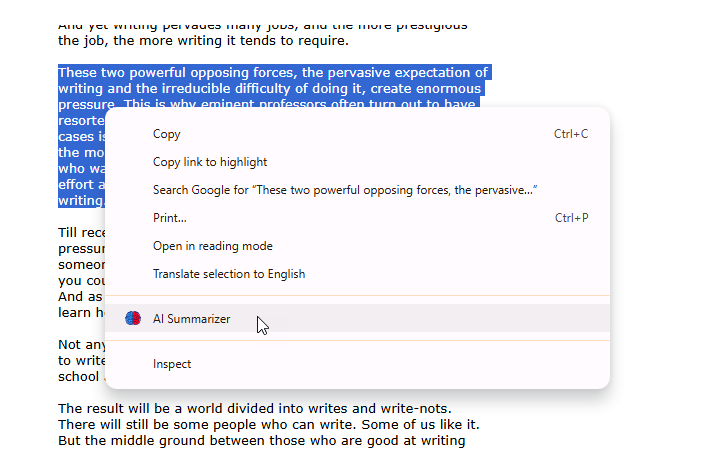
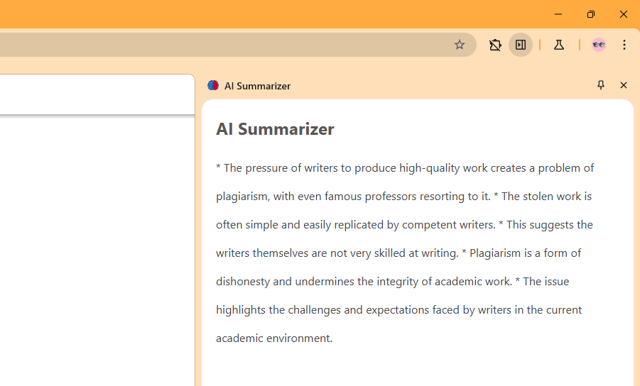

# How to use the AI Summarizer Chrome Extension

## Step 1: Setup Chrome Canary

* Since the necessary APIs are still under development, this extension is not supported in the stable builds of Chrome. To test the extension, please use the [latest Canary build](https://www.google.com/search?q=download+chrome+canary) of Chrome on Windows, macOS or Linux.

* Open Chrome Canary, and go to `chrome://flags/#summarization-api-for-gemini-nano`, and select *Enabled*. Now restart your browser to apply changes.

## Step 2: Setup Gemini Nano LLM

This extension utilizes Google's Gemini Nano AI model, which requires a one-time setup. The model is automatically downloaded in the background when a website or the extension accesses it for the first time.

When you use the extension for the first time, the required Gemini Model will begin downloading automatically in the background. As a result, the extension may not function immediately on the initial attempt. The time required for the model to download and activate depends on your device's configuration and internet speed.

## Step 3: Use the Extension

After completing the steps above, you’re ready to use the extension. Simply visit any webpage, select a text snippet, right-click on it, and choose the "AI Summarizer" option from the context menu, as shown in the screenshot below.

This should load an AI generated summary of the selected text in a side panel:

